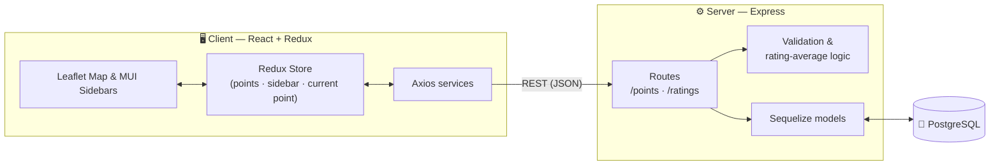

<div align="center">

# 🗺️ Voyage

### An interactive map for discovering, adding, and rating points of interest along your travels.

A full-stack, fully-typed **TypeScript** application built around an interactive Leaflet map. Users can drop points directly on the map, categorize them as hiking routes, attractions, or scenic viewpoints, and rate them — with average ratings recomputed on the server in real time.

<br/>

[](https://react.dev/)
[](https://www.typescriptlang.org/)
[](https://redux.js.org/)
[](https://react-leaflet.js.org/)
[](https://mui.com/)
[](https://expressjs.com/)
[](https://sequelize.org/)
[](https://www.postgresql.org/)
[](https://www.docker.com/)
[](https://vitejs.dev/)

</div>

---

## 📸 Demo

> **Add a screenshot or GIF here** — a short recording of dropping a point on the map and rating it makes the strongest first impression for a portfolio. Place the file in a `docs/` folder and update the path below.

<!--
TIP: Record a quick clip with ScreenToGif / Kap, save it as docs/demo.gif, then replace the line below.
-->

<div align="center">

<!--  -->
`📍 Screenshot / demo GIF goes here`

</div>

---

## ✨ Features

- **🗺️ Interactive map** — pan, zoom, and explore points rendered as colored circles over OpenStreetMap tiles (via Leaflet).
- **📍 Two ways to add a point** — type coordinates manually, *or* toggle pin-drop mode and click anywhere on the map to capture the exact latitude/longitude.
- **🏷️ Categorized points** — each point is a **hiking route**, an **attraction**, or a **scenic viewpoint**, color-coded on the map for instant recognition.
- **💰 Context-aware form** — the price field appears only for attractions, keeping the form clean for other point types.
- **⭐ Ratings** — rate any point from 1–5 stars; the server stores the rating and recomputes the point's running average automatically.
- **✅ Validation on both ends** — coordinate bounds, description length, and price rules are enforced in the client *and* re-validated on the server.
- **🌐 Full RTL / Hebrew UI** — the interface is built right-to-left with Hebrew labels throughout.
- **🐳 One-command setup** — the whole stack (client, API, database) spins up with a single Docker Compose command.

---

## 🧱 Tech Stack

| Layer | Technologies |
| --- | --- |
| **Frontend** | React 18, TypeScript, Vite, Redux + Redux Thunk, React-Leaflet, Material UI (MUI) + Emotion, Axios |
| **Backend** | Node.js, Express, TypeScript, Sequelize (ORM), `ts-node` + Nodemon |
| **Database** | PostgreSQL |
| **Infra** | Docker & Docker Compose |

---

## 🏗️ Architecture

A clean client/server split. The React app talks to the Express API over HTTP; the API persists everything to PostgreSQL through Sequelize.



When a rating is submitted, the server stores the individual rating, fetches every rating for that point, recalculates the average, and writes it back to the point — so the displayed average is always consistent with the underlying data.

---

## 🚀 Getting Started

### Option A — Docker (recommended)

The repository ships with a `docker-compose.yml` that builds the client, the API, and a PostgreSQL database together.

```bash
# from the project root
docker compose up --build
```

| Service | URL |
| --- | --- |
| Client (Vite dev server) | http://localhost:3000 |
| API (Express) | http://localhost:5000 |
| PostgreSQL | localhost:5430 |

Open **http://localhost:3000** and you're ready to drop your first point.

### Option B — Run locally without Docker

You'll need **Node.js**, **npm**, and a running **PostgreSQL** instance.

```bash
# 1. Start the API
cd server
npm install
npm run dev          # http://localhost:5000

# 2. In a second terminal, start the client
cd client
npm install
npm run dev          # http://localhost:3000
```

> **Note:** the database connection in [`server/config/database.ts`](server/config/database.ts) is preconfigured for the Docker network (host `db`). When running outside Docker, point `host` to your local Postgres instance (e.g. `localhost`) and update the credentials to match your setup.

---

## 📡 API Reference

Base URL: `http://localhost:5000`

| Method | Endpoint | Description |
| --- | --- | --- |
| `GET` | `/points` | Fetch all points |
| `GET` | `/point/:id` | Fetch a single point by id |
| `POST` | `/points/new` | Create a new point |
| `PATCH` | `/point/:id/rating` | Update a point's average rating |
| `GET` | `/ratings/:pointId` | Get all ratings for a point |
| `POST` | `/ratings/new` | Add a rating and recompute the point's average |

**Point shape**

```ts
{
  id: string;
  latitude: number;        // -90 .. 90
  longitude: number;       // -180 .. 180
  description: string;     // 1–256 characters
  pointType: "hiking route" | "attraction" | "scenic viewpoint";
  price?: number;          // attractions only — non-negative integer
  avgRating?: number;      // computed server-side, 1 decimal
}
```

---

## 📂 Project Structure

```
voyage/
├── docker-compose.yml
├── client/                       # React + Vite frontend
│   └── src/
│       ├── pages/                # ToursMap — the main map view
│       ├── components/           # AddPoint / DisplayPoint sidebars, map controls
│       ├── redux/                # actions, reducers, constants, store, thunks
│       ├── services/             # Axios API clients
│       └── types/                # shared TypeScript types
└── server/                       # Express + Sequelize API
    ├── app.ts                    # app entry
    ├── routes/                   # points & ratings endpoints
    ├── models/                   # Sequelize models (point, pointRating)
    ├── utils/                    # validation & average-rating helpers
    └── config/                   # database connection
```

---

## 🧠 Engineering Highlights

A few decisions worth calling out:

- **End-to-end type safety** — shared, explicit types flow from the Sequelize models through the Express routes to the React components and Redux store.
- **Defense-in-depth validation** — the same coordinate, description, and price rules are enforced client-side for UX and re-checked server-side for integrity.
- **Server-authoritative averages** — clients never compute or trust their own rating averages; the server is the single source of truth.
- **Map-driven UX** — clicking the map captures precise coordinates (with longitude normalized into the `-180..180` range), so users don't have to know their exact lat/long.
- **Predictable state** — Redux + Thunk centralizes map points, the active sidebar, and the currently-selected point, keeping the UI in sync as data changes.

---

## 🛣️ Roadmap

Ideas for where this could go next:

- [ ] Automated tests (unit + integration) and CI
- [ ] User accounts & authentication (one rating per user per point)
- [ ] Editing and deleting points
- [ ] Filtering and search by point type, price, or rating
- [ ] Internationalization (English UI alongside Hebrew)
- [ ] Production Docker build with a static client served behind Nginx

---

<div align="center">

Built with TypeScript, end to end.

</div>
